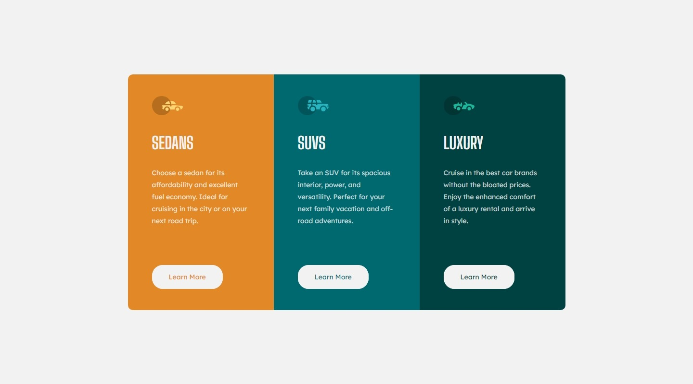

# Frontend Mentor - 3-column preview card component solution

This is a solution to the [3-column preview card component challenge on Frontend Mentor](https://www.frontendmentor.io/challenges/3column-preview-card-component-pH92eAR2-). Frontend Mentor challenges help you improve your coding skills by building realistic projects. 

## Table of contents

- [Overview](#overview)
  - [The challenge](#the-challenge)
  - [Screenshot](#screenshot)
  - [Links](#links)
- [My process](#my-process)
  - [Built with](#built-with)
  - [Useful resources](#useful-resources)
- [Author](#author)

## Overview

### The challenge

The challenge is to make the design as close to the proposed image as possible.The following elements should be taken into account: 

- View the optimal layout depending on their device's screen size
- See hover states for interactive elements

### Screenshot
Screenshot of the desktop page 1440px x 800px 

Screenshot of the phone page 375px x 800px 

  

### Links

- Live Site URL: [Live Site Here](https://3-columns-felipaodev.netlify.app/)

### Built with

- Semantic HTML5 markup
- CSS custom properties
- Flexbox

### Continued development

I want to learn more about responsive design, so that the pages can adapt much better to different devices, taking into account media query and different design techniques.

### Useful resources

- [css-tricks](https://css-tricks.com/) - Within this page there are large sections related to learning css, the one I used the most was the FlexBox section. 

## Author

- Frontend Mentor - [@Felipao-Dev](https://www.frontendmentor.io/profile/Felipao-Dev)

- GitHub - [Felipao-Dev](https://github.com/Felipao-Dev)
